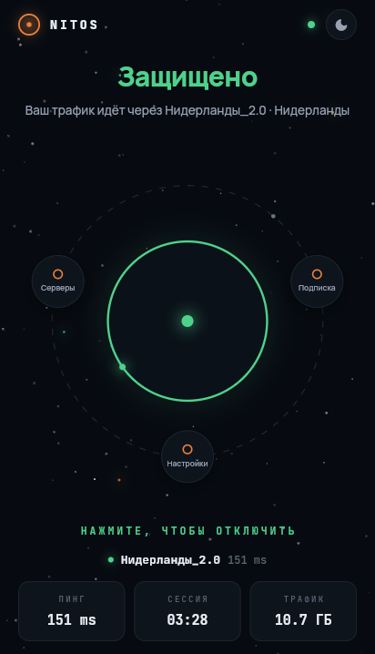

<div align="center">

# 🪐 NITOS

[](https://t.me/nitos_space)


[](https://nitos.space)
[](https://t.me/nitos_vpn_bot)
[](https://github.com/Heekuez/nitos-releases/releases/latest)
[](https://github.com/Heekuez/nitos-releases/releases)

<p>
  
  
</p>

</div>

## Скачать

<!-- DL -->
| Платформа | Скачать |
|---|---|
| Android / Android TV | **[NITOS-2.9.4.apk](https://github.com/Heekuez/nitos-releases/releases/download/v2.9.4/NITOS-2.9.4.apk)** |
| Windows | **[на странице релиза](https://github.com/Heekuez/nitos-releases/releases/latest)** |
| Ubuntu / Debian / Mint | **[на странице релиза](https://github.com/Heekuez/nitos-releases/releases/latest)** |
| Другой Linux | **[на странице релиза](https://github.com/Heekuez/nitos-releases/releases/latest)** |
<!-- /DL -->

## Роутер (бета)

VPN один раз на роутере — работает у всех устройств дома сразу.

| Роутер | Поддержка | Как |
|---|---|---|
| **Keenetic** | ✅ | без перепрошивки, через Entware → [гайд](router/GUIDE.md#keenetic) |
| **GL.iNet** | ✅ | работает из коробки → [гайд](router/GUIDE.md#glinet) |
| **Xiaomi, TP-Link, ASUS…** | ⚙️ | после прошивки OpenWRT → [гайд](router/GUIDE.md#openwrt) |
| **Huawei, Tenda, от провайдера** | ❌ | прошивка закрыта |

Установка — одна команда по SSH ([подробный гайд](router/GUIDE.md)):

```sh
curl -fsSL https://raw.githubusercontent.com/Heekuez/nitos-releases/main/router/install.sh | sh -s -- "ССЫЛКА"
```

`ССЫЛКА` — ваша подписка или vless-конфиг. Удаление: тот же скрипт с `--uninstall`.
