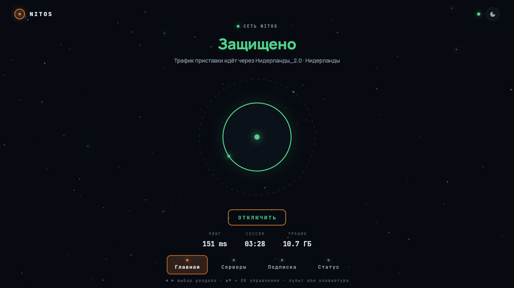

# 🪐 NITOS

**Защищённая сеть. Космос вместо настроек.**

  
  

  

## Загрузки

**[⬇ Последняя версия — на странице релизов](https://github.com/Heekuez/nitos-releases/releases/latest)**

| Платформа | Файл | Установка |
|---|---|---|
| **Android** (телефон и Android TV) | `NITOS-x.y.z.apk` | скачать и открыть; разрешить установку из неизвестных источников |
| **Windows** | `NITOS-Setup-x.y.z.exe` | запустить установщик; если SmartScreen предупреждает — «Подробнее → Выполнить в любом случае» |
| **Ubuntu / Debian / Mint** | `nitos_x.y.z_amd64.deb` | двойной клик или `sudo apt install ./nitos_x.y.z_amd64.deb` |
| **Другой Linux** | `NITOS-x.y.z-linux-x64.tar.gz` | распаковать, запустить `./nitos_client` |

К каждому релизу приложены SHA256-хеши файлов.

## Возможности

- Подключение в один тап — планета в кольце и есть кнопка
- Несколько источников: ссылки-подписки и `vless://` конфиги, QR-скан, буфер
- Живой пинг серверов, избранное, автовыбор быстрейшего
- Тёмная «космос» и светлая темы
- Windows: автозапуск с системой, трей, «поставил и забыл»
- Android TV: управление с пульта
- Не логируем трафик — клиенту просто нечем: он ваш, локальный

## Протоколы

`VLESS` · `Reality` · `XTLS Vision` · `TLS`

## Право

Приложение — инструмент доступа к вашей собственной сети. Ответственность
за использование лежит на пользователе. Исходный код клиента — в приватной
репе, здесь публикуются только готовые сборки.

---

Сайт: <a href="https://nitos.space">nitos.space</a>

